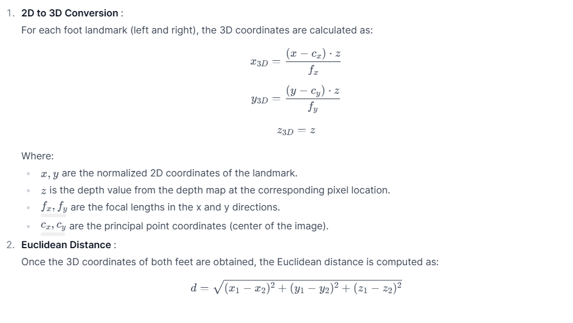
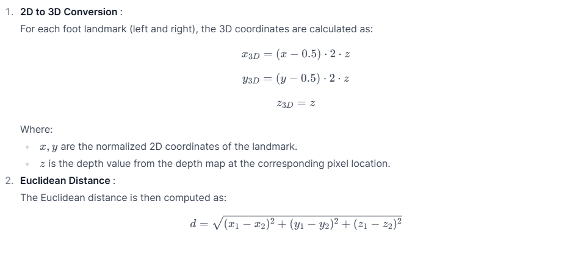
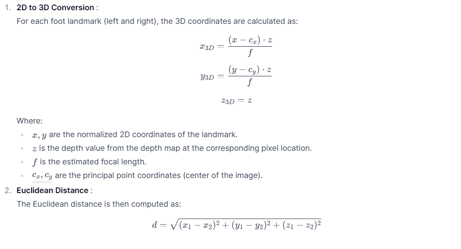
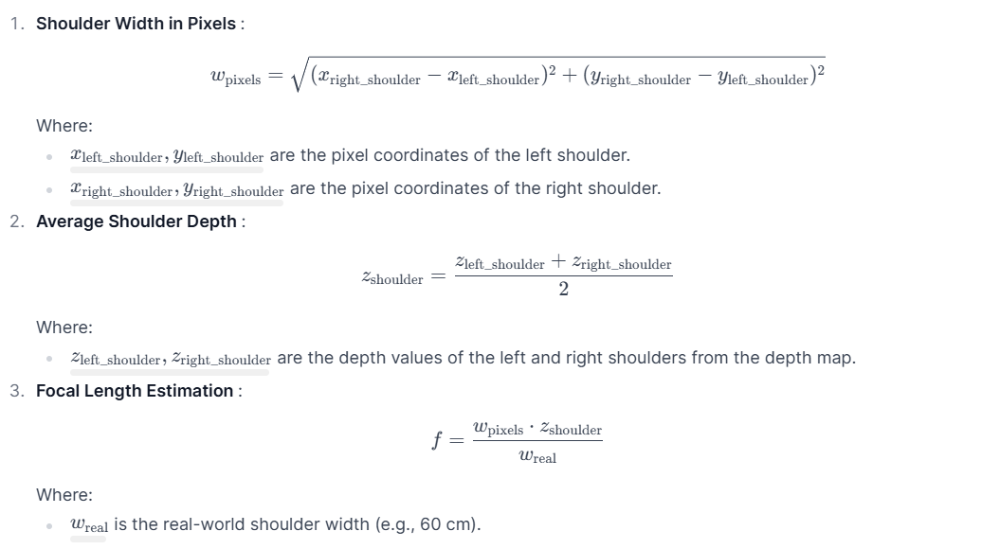
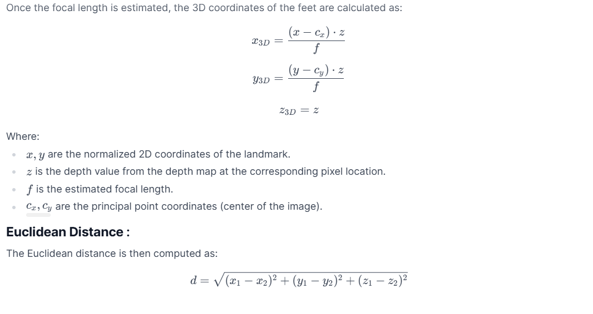

# Foot Distance Estimation using DepthPro for depth estimation and MediaPipe for pose detection

## Overview

This project estimates the distance between feet in videos using **DepthPro** (for depth estimation) and **MediaPipe** Pose (for pose detection). It implements **four** advanced methods to measure foot distance based on different 3D coordinate extraction techniques and estimated focal length. The project processes videos in real-time, overlays distance metrics on frames, and outputs annotated videos.


## Features

- Uses `DepthPro` for depth estimation.
- Utilizes `Mediapipe Pose` for pose landmark detection.
- Computes foot distance using multiple methods:
  1. **Pinhole Camera Model**
  2. **Avoiding Camera Calibration**
  3. **Estimated Focal Length from Model**
  4. **Focal Length from Shoulder Proportions**
- Processes video frames and overlays distance calculations on the output video.

## Installation

### Install Required Dependencies

```bash
pip install git+https://github.com/huggingface/transformers.git
pip install mediapipe opencv-python numpy torch pillow
```

## Usage

### Running the Script

```python
video_path = '/content/input_video.mp4'  # Replace with your video path
output_path = '/content/output.mp4'  # Define output file path
process_video(video_path, output_path)
```

### Functions

- `estimate_depth_and_focal_length(frame)`: Estimates the depth map and focal length from the input frame.
- `convert_2d_to_3d_pinhole(landmarks_2d, depth_map, focal_length)`: Converts 2D pose landmarks into 3D coordinates using the pinhole camera model.
- `extract_3d_coordinates_without_calibration(landmarks_2d, depth_map)`: Extracts 3D coordinates without using camera calibration.
- `compute_3d_with_estimated_focal(landmarks_2d, depth_map, estimated_focal)`: Uses estimated focal length to compute 3D coordinates.
- `estimate_focal_length_from_shoulder(shoulder_width, depth)`: Estimates the focal length using shoulder width and depth.
- `compute_3d_euclidean_distance(feet_3d)`: Computes 3D Euclidean distance between feet.
- `compute_foot_distance_with_focal(feet_2d, depth_map, focal_length)`: Computes foot distance using estimated focal length.
- `process_video(video_path, output_path)`: Processes a video, extracts depth and pose landmarks, calculates distances, and generates an annotated output video.


## Output

- The script generates a processed video where distances calculated using different methods are displayed on each frame.

## References

- [Hugging Face Transformers](https://github.com/huggingface/transformers)
- [Mediapipe Pose](https://developers.google.com/mediapipe/solutions/vision/pose)
- [DepthPro-hf](https://huggingface.co/apple/DepthPro-hf)


# Documentation of Foot Distance Calculation Methods

This detailed descriptions and mathematical equations for the four methods used to calculate foot distance.

---

## Method 1: Pinhole Camera Model

This method acalculates the 3D Euclidean distance between the left and right feet using the pinhole camera model. The pinhole camera model assumes that the intrinsic parameters (focal length and principal point) are known or can be estimated.

### **Mathematical Equations**



---

## Method 2: Avoiding Calibration

This method simplifies the calculation by avoiding explicit calibration of intrinsic parameters. It assumes the camera has a normalized field of view and uses the depth directly to scale the 2D coordinates.

### **Mathematical Equations**


---

## Method 3: Using Estimated Focal Length and Depth Map

This method uses an estimated focal length provided by the DepthPro model to calculate the 3D coordinates of the feet.

### **Mathematical Equations**


---

## Method 4: Focal Length from Shoulder Proportions

This method estimates the focal length based on the shoulder width in pixels and its real-world size, then uses this focal length to calculate the 3D coordinates of the feet.

### **Steps for Focal Length Estimation**





---

## Summary Table of Methods


Each method provides a different approach to calculating the foot distance, leveraging either explicit or implicit assumptions about the camera's intrinsic parameters.